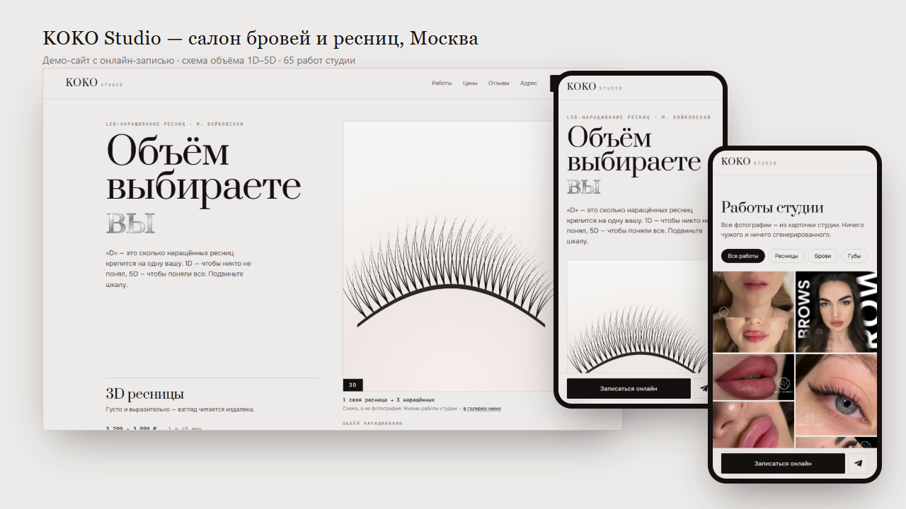

# KOKO Studio — сайт салона бровей и ресниц

**Живой сайт → [bmxer32.github.io/koko-studio-demo](https://bmxer32.github.io/koko-studio-demo/)**

Салон у м. Войковская с рейтингом 5.0 и 148 отзывами на Яндекс Картах, у которого
не было сайта: только карточка в Яндекс Бизнесе и запись перепиской в Telegram.

Весь контент собственный — 65 работ студии, 26 услуг с ценами и длительностью,
отзывы дословно. Ничего сгенерированного и ничего стокового.

### Что интересного внутри

**Шкала объёма 1D–5D на первом экране.** «D» — это сколько наращённых ресниц крепится
на одну свою, и ползунок рисует ровно это: SVG-схема ресничного ряда, где на каждую
свою ресницу вешается N наращённых, а дробный объём чередует (1,5D — то одна, то две).
Отвечает на вопрос, который клиентки чаще всего задают в личку, и при этом не выдаёт
конкретную работу студии за объём, которым её никто не подписывал.

**Онлайн-запись вместо переписки.** Кнопка открывает рабочий YCLIENTS студии в модалке:
услуга, мастер, живое расписание. Telegram и WhatsApp остались запасным путём.

**Мобильный формат первичный** — почти весь трафик приходит с Яндекс Карт с телефона.
Липкая панель записи внизу экрана, галерея на 65 работ с фильтрами и лайтбоксом,
webp в двух размерах, ~1,7 МБ на первый экран сетки.

Без сборки и зависимостей: ванильные HTML/CSS/JS, SVG генерируется на лету,
внешние запросы — только Google Fonts, карта Яндекса и виджет записи.

---

## Что где

| Файл | Что это |
|---|---|
| `index.html` | сам сайт |
| `predlozhenie.html` | страница-оффер клиенту: демо + AI-ассистент (narodniy-team.ru/ai) |
| `assets/css/style.css` | стили |
| `assets/js/data.js` | **все данные салона** — прайс, отзывы, объёмы, категории фото |
| `assets/js/app.js` | логика: шкала объёма, галерея, прайс, модалка записи |
| `assets/photo/*.webp` | 84 фото в двух размерах (560 и 1200 px) — то, что грузит сайт |
| `assets/img/*.jpg` | оригиналы фото в исходном разрешении (в прод не нужны) |

Правки контента делаются в `assets/js/data.js`, вёрстку трогать не нужно.

## Откуда данные

Ничего не выдумано и не сгенерировано:

* **Схема объёма** на первом экране — не изображение, а SVG, который строится из числа
  наращённых ресниц на одну свою. Ни одна работа студии не подписана объёмом, которого
  мы не знаем.
* **Фото** — 84 шт., выкачаны из карточки студии в Яндекс Бизнесе
  (`avatars.mds.yandex.net/get-altay/...`, размер `orig`). Категории (ресницы /
  брови / губы / косметология / студия) проставлены вручную по просмотру каждого кадра.
* **Прайс и длительность** — из их YCLIENTS (`n596014.yclients.com`, компания 563183)
  и каталога на clients.site. Диапазон цены = ведущий мастер → топ-мастер.
* **Отзывы** — дословно с Яндекс Карт (5.0, 148 отзывов).
* **Мастера** — Диана (ведущий), Екатерина и Екатерина С. (топ) — из формы записи YCLIENTS.
* **Тексты о студии** — пересказ их собственного описания, короче и без канцелярита.

## Онлайн-запись

Кнопка «Записаться» открывает модалку с **их настоящим YCLIENTS** в iframe:
`https://n596014.yclients.com/company/563183/personal/select-services?o=`

Живое расписание, выбор мастера и услуги, подтверждение — всё их.
Внизу модалки ссылка «открыть в новой вкладке» и Telegram на случай проблем.

> Проверять запись нужно **по http/https**, а не открытием `index.html` из проводника:
> с `file://` виджет ругается. Локально: `node serve.mjs` → http://localhost:8777

## Что нужно уточнить у клиента

1. **Схема на шкале 1D–5D** — рисуется кодом из `volumes[].count`: на каждую свою ресницу
   вешается `count` наращённых, дробный объём чередует floor и ceil (1,5D — то одна, то две).
   Это схема, а не фото: подписывать реальные работы объёмами наугад нельзя, они не размечены.
   Если студия разметит свои фото по объёмам — можно будет вернуть фотографии.
2. **Цены на перманентный макияж бровей и губ** — их нет ни в YCLIENTS, ни в каталоге.
   Сейчас на сайте написано «цену уточним в чате».
3. **Часы работы** — нигде не опубликованы, поэтому написано «приём по записи».
4. Акция «приводи подруг» действует до 31.08.2026 — после этой даты блок убрать
   (секция `#promo` в `index.html`).

## Технические заметки

* Мобильный формат первичный, десктоп — расширение. Внизу экрана липкая панель записи.
* Изображения — webp, всего ~7.8 МБ на 168 файлов; в вьюпорт грузится 12 карточек,
  остальные по кнопке «показать ещё» + `loading="lazy"`.
* Шрифты: Prata (заголовки), Onest (текст), JetBrains Mono (цифры, метки) — все с кириллицей.
* Есть фокус с клавиатуры, `prefers-reduced-motion`, alt у всех фото.
* Никаких внешних зависимостей кроме Google Fonts, карты Яндекса и виджета YCLIENTS.

## Служебные скрипты (в прод не нужны)

`scrape.mjs`, `scrape2.mjs`, `scrape_yclients.mjs` — сбор данных;
`download_photos.mjs`, `optimize.mjs` — фото; `contactsheet.mjs` — контактные листы для
разбора фото; `shot*.mjs`, `qa*.mjs` — скриншоты и проверки; `serve.mjs` — локальный сервер.
